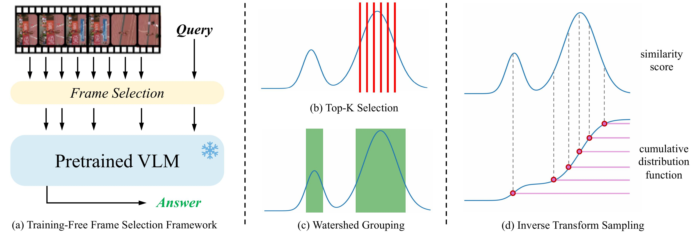

# BOLT: Boost Large Vision-Language Model Without Training for Long-form Video Understanding

<p align="left">
<a href="https://arxiv.org/abs/2503.21483" alt="arXiv">
    </a>
</p>

This is the official implementation of the paper [BOLT: Boost Large Vision-Language Model Without Training for Long-form Video Understanding](https://arxiv.org/abs/2503.21483), which is accepted by CVPR2025.

- Code will be released soon.

## Abstract

Large video-language models (VLMs) have demonstrated promising progress in various video understanding tasks. However, their effectiveness in long-form video analysis is constrained by limited context windows. Traditional approaches, such as uniform frame sampling, often inevitably allocate resources to irrelevant content, diminishing their effectiveness in real-world scenarios. In this paper, we introduce BOLT, a method to BOost Large VLMs without additional Training through a comprehensive study of frame selection strategies. First, to enable a more realistic evaluation of VLMs in long-form video understanding, we propose a multi-source retrieval evaluation setting. Our findings reveal that uniform sampling performs poorly in noisy contexts, underscoring the importance of selecting the right frames. Second, we explore several frame selection strategies based on query-frame similarity and analyze their effectiveness at inference time. Our results show that inverse transform sampling yields the most significant performance improvement, increasing accuracy on the Video-MME benchmark from 53.8% to 56.1% and MLVU benchmark from 58.9% to 63.4%.

<p align="center">
    </a> <br>
</p>

## Citation

Our code is based on [lmms-eval](https://github.com/EvolvingLMMs-Lab/lmms-eval). We would like to express our gratitude for their outstanding work.

If you think this repo is helpful, please cite us:

```bibtex
@inproceedings{liu2025bolt,
    author    = {Liu, Shuming and and Zhao, Chen and Xu, Tianqi and Ghanem, Bernard},
    title     = {BOLT: Boost Large Vision-Language Model Without Training for Long-form Video Understanding},
    booktitle = {Proceedings of the IEEE/CVF Conference on Computer Vision and Pattern Recognition (CVPR)},
    month     = {June},
    year      = {2025},
}
```

If you have any questions, please contact: `shuming.liu@kaust.edu.sa`.